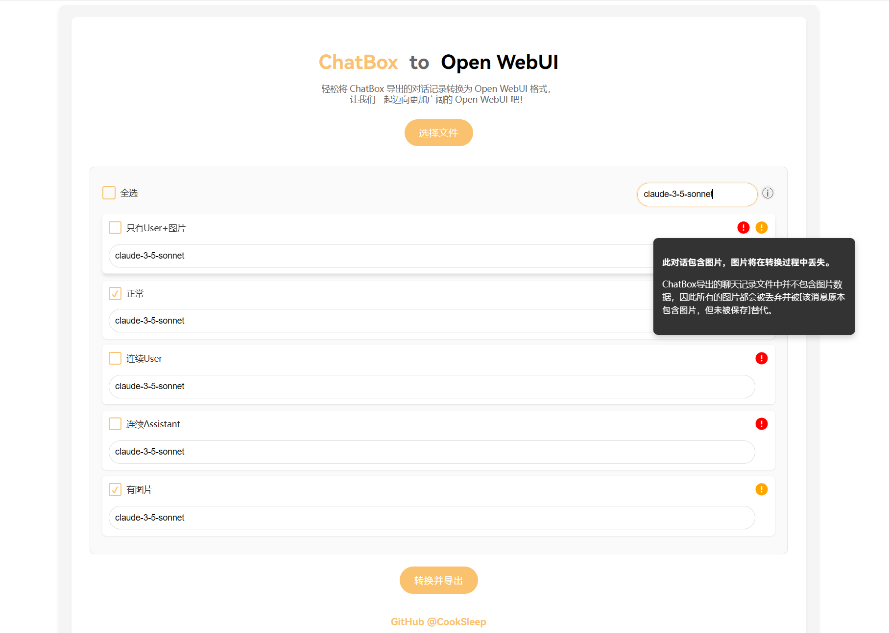

<h1 align="center">ChatBox to OpenWebUI</h1>

ChatBox to OpenWebUI 是一个在线工具，帮助用户便捷地将 ChatBox 导出的对话记录转换为 Open WebUI 格式。

它允许用户上传 ChatBox 导出的 JSON 文件，并自动将其转换为 Open WebUI 兼容的格式，方便用户将聊天记录从轻量化的 [ChatBox](https://github.com/Bin-Huang/chatbox) 迁移到功能更加丰富的 [Open WebUI](https://github.com/open-webui/open-webui)。

该项目的代码主要由 `claude-3.5-sonnet` 和 `chatgpt-4o-latest` 编写，我提供了非常多的样式、功能设计提议和反馈。

## 功能特性

- 自动检测并提示含有不成对的消息（可能不受Open WebUI支持），或是包含图片（未包含在ChatBox的导出数据中）的对话
- 允许用户为每个对话指定使用的模型，使其显示在历史记录中
- 支持全选/取消选择要转换的对话
- 生成兼容 Open WebUI 格式的 JSON 文件
- 响应式设计，支持桌面和移动设备

## 如何使用

1. 访问 [ChatBox to Open WebUI](https://cooksleep.github.io/ChatBox2OpenWebUI/)。
2. 在 ChatBox 的`设置-其它-备份与恢复`中**只勾选`聊天记录`**，然后导出。
3. 点击`选择文件`按钮，选择刚刚从 ChatBox 导出的 JSON 文件。
4. 查看上传的对话列表，根据需要选择或取消选择从 ChatBox 中导出的对话。
5. 为每个对话指定使用的模型(可选)。
6. 点击`转换并导出`按钮生成 Open WebUI 格式的 JSON 文件。
7. 在 Open WebUI 的`设置-对话-导入聊天记录`中选择刚刚生成的文件。
8. 刷新 Open WebUI 页面，完成数据导入。

## 贡献

欢迎对项目进行贡献！如果您有任何建议或想要添加新功能，请随时创建一个 Issue 或 Pull Request。

## 许可证

本项目采用 [GNU General Public License v3.0](https://www.gnu.org/licenses/gpl-3.0.html) 许可证，详情请见 [LICENSE](LICENSE) 文件。
